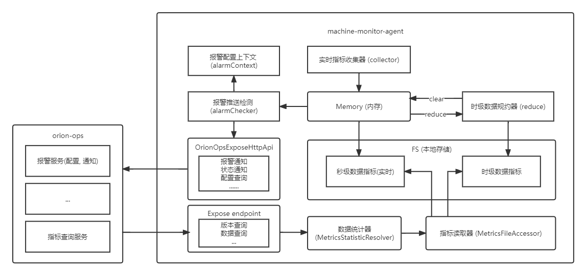

<p style="margin-top: 12px" align="center"><b>此项目为 `orion-ops` 的拓展插件仓库, 目前仅包含了机器监控数据采集端</b></p>
<p align="center">
	<a target="_blank" style="text-decoration: none" href="https://www.codacy.com/gh/lijiahangmax/orion-ops-extension-plugins/dashboard?utm_source=github.com&amp;utm_medium=referral&amp;utm_content=lijiahangmax/orion-ops-extension-plugins&amp;utm_campaign=Badge_Grade">
		
	</a>
    <a target="_blank" style="text-decoration: none !important;" href="https://github.com/lijiahangmax/orion-ops-extension-plugins/releases">
      
    </a>
	<a target="_blank" style="text-decoration: none" href="https://www.apache.org/licenses/LICENSE-2.0">
		
	</a>
	<a target="_blank" style="text-decoration: none" href="https://gitee.com/lijiahangmax/orion-ops-extension-plugins/stargazers">
		
	</a>
	<a target="_blank" style="text-decoration: none" href="https://gitee.com/lijiahangmax/orion-ops-extension-plugins/members">
		
	</a>		
	 <a target="_blank" style="text-decoration: none" href="https://github.com/lijiahangmax/orion-ops-extension-plugins">
		
	</a> 
</p>

------------------------------

<p><b>⛔⛔此页面已不再维护, 请跳转至 
<a target="_blank" href="https://lijiahangmax.github.io/open-orion/orion-ops-extension-plugins">这里</a> 
查看最新文档 ❗</b></p>

------------------------------

### orion ops 拓展插件

* [github](https://github.com/lijiahangmax/orion-ops-extension-plugins)
* [gitee](https://gitee.com/lijiahangmax/orion-ops-extension-plugins)
* [orion-ops](https://lijiahangmax.github.io/open-orion/orion-ops)
* [文档](https://lijiahangmax.github.io/open-orion/orion-ops-extension-plugins)

### 项目结构

```
orion-ops-plugins-parent          后端服务父工程  
    │ 
    ├── plugin-common             插件公共工程  
    │  
    └── machine-monitor-agent     机器监控 agent  
```

### machine-monitor-agent (机器监控数据采集端)

* [快速开始(下载)](/machine-monitor-agent/quickstart-download)
* [快速开始(构建)](/machine-monitor-agent/quickstart-build)
* [常见问题](/machine-monitor-agent/faq)



## 联系我

  

📧 添加备注: ops

## 支持一下

  

🎁 为了项目能健康持续的发展, 我期望获得相应的资金支持, 你们的支持是我不断更新前进的动力!

## License

使用 [Apache-2.0](https://github.com/lijiahangmax/orion-ops-extension-plugins/blob/main/LICENSE) 开源许可证。
