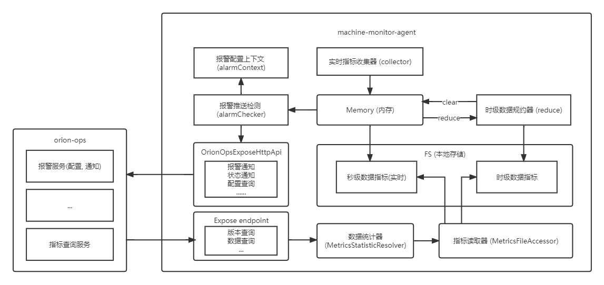

### 总体架构

### 监控指标文件存储在哪里?

监控指标数据会存储在文件中。  
其中又分为了秒级数据和时级别数据, 在查询时会根据请求的数据粒度进行文件访问, 达到大范围高性能查询。

### agent 和 server 是如何通信的?

agent 和 server 是通过 http 进行双向通信的。   
agent 在启动时会推送启动状态到 server, 同时 server 更新运行状态。  
agent 在启动后会通过 server 暴露的 api 查询报警配置, 从而设置到 alarmContext 中。  
server 修改了报警配置后, 会通过 agent 暴露的 api 通知报警配置。  
server 在查询监控指标时, 调用 agent api, agent 会根据统计的数据粒度进行查询不同范围的指标文件。
